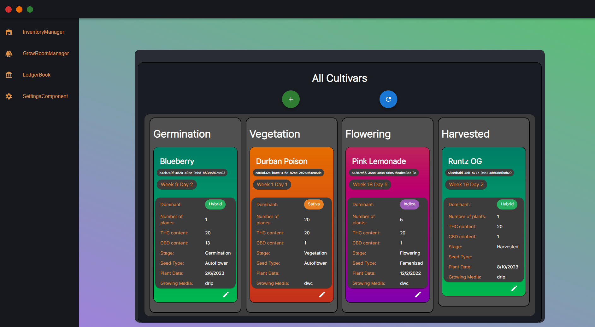

    

 

# Rainforest Desktop V2

Commercial grow house management system build with React.js and Electron.js

## Applications

#### Grow Room Manager

- Manage cultivars batches information.
- Documents previous growing operation events (maintnance, harvesting).

#### Inventory Manager

- Manage all the inventory and post processing of product.
- Show income estimation and statistics.
- Documents post-production events.

#### Ledger Book

- Records of sales and purchase to and from other license holders.
- Show estimation for annual licensing fee acoording to the licensing formula.
